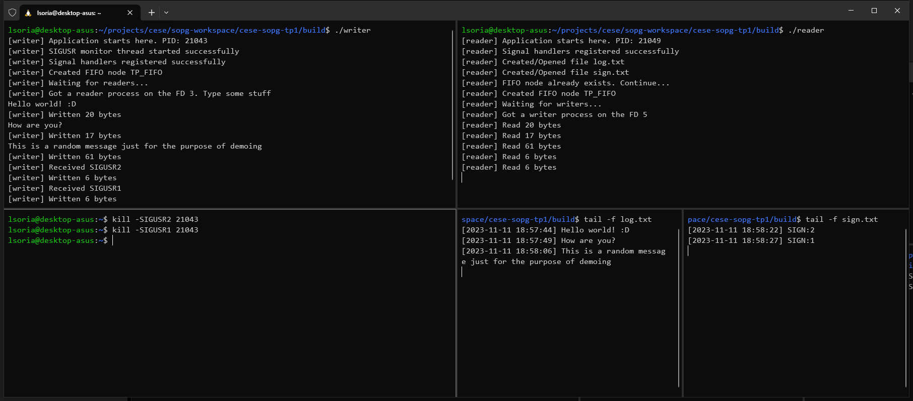
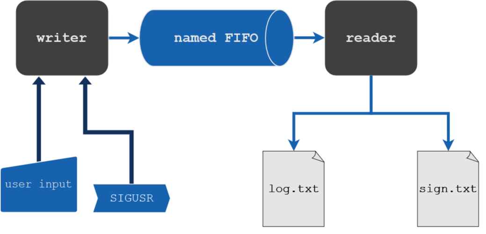

# SOPG - TP1




Trabajo Práctico 1 de la materia Sistemas Operativos de Propósito General (SOPG) del Curso de Especialización en Sistemas Embebidos (CESE).

**Autor:** Ing. Leandro Soria.

## Tabla de Contenidos
1. [Objetivo](#objetivo)
2. [Partes del Sistema](#partes-del-sistema)
3. [Arquitectura del Sistema](#arquitectura-del-sistema)
4. [Buildeame!](#buildeame)
5. [Limpiar carpeta `build`](#limpiar-carpeta-build)
6. [Instrucciones de Ejecución](#instrucciones-de-ejecución)
## Objetivo
Comunicar dos procesos por medio de un named FIFO. El proceso `writer` podrá recibir texto por la
consola y signals. El proceso `reader` deberá loggear en un archivo el texto que recibió el proceso
`writer` y en otro archivo las signals que recibe el proceso `writer`.

## Partes del Sistema

### Proceso `writer`:
Este proceso iniciará y se quedará esperando que el usuario ingrese texto hasta que presione
`ENTER`. En ese momento escribirá en una named FIFO los datos con el siguiente formato:
```
DATA:XXXXXXXXX
```
En cualquier momento el proceso podrá recibir las signals `SIGUSR1` y `SIGUSR2`. En dicho caso
deberá escribir en el named FIFO el siguiente mensaje:
```
SIGN:1  (si recibió SIGUSR1)
SIGN:2  (si recibió SIGUSR2)
```

### Proceso `reader`:
Este proceso leerá los datos del named FIFO y según el encabezado `DATA` o `SIGN` escribirá en el
archivo `log.txt` o `signals.txt`.

## Arquitectura del Sistema



## Buildeame!

```
git clone https://github.com/lmsoria/cese-sopg-tp1.git
cd cese-sopg-tp1
chmod +x build.sh
./build.sh compile
```

## Limpiar carpeta `build`
```
./build.sh clean
```

## Instrucciones de Ejecución

1. En una terminal ejecutar `writer`:
```
$ ./writer
[writer] Application starts here. PID: 21043
[writer] SIGUSR monitor thread started successfully
[writer] Signal handlers registered successfully
[writer] Created FIFO node TP_FIFO
[writer] Waiting for readers...
```
2. En otra terminal ejecutar `reader`:
```
$ ./reader
[reader] Application starts here. PID: 21049
[reader] Signal handlers registered successfully
[reader] Created/Opened file log.txt
[reader] Created/Opened file sign.txt
[reader] FIFO node already exists. Continue...
[reader] Created FIFO node TP_FIFO
[reader] Waiting for writers...
[reader] Got a writer process on the FD 5
```

3. Desde `writer` se pueden empezar a mandar mensajes:
```
[writer] Got a reader process on the FD 3. Type some stuff
Hello world! :D
[writer] Written 20 bytes
How are you?
[writer] Written 17 bytes
This is a random message just for the purpose of demoing
[writer] Written 61 bytes
```

4. Desde reader se irá notificando que van llegando:
```
[reader] Read 20 bytes
[reader] Read 17 bytes
[reader] Read 61 bytes
```

5. Se puede ir monitoreando el contenido de los archivos en terminales separadas:
```
$ tail -f log.txt
[2023-11-11 18:57:44] Hello world! :D
[2023-11-11 18:57:49] How are you?
[2023-11-11 18:58:06] This is a random message just for the purpose of demoing
```

6. Desde una terminal nueva se pueden mandar las señales `SIGUSR`. Ambos programas anuncian su PID cuando comienzan a ejecutarse:
```
$ kill -SIGUSR2 21043
$ kill -SIGUSR1 21043
```

7. Las señales son notificadas por wl proceso `writer`:
```
[writer] Received SIGUSR2
[writer] Written 6 bytes
[writer] Received SIGUSR1
[writer] Written 6 bytes
```
8. Para ver la evolución del log de señales se puede consultar `sign.txt`:
```
$ tail -f sign.txt
[2023-11-11 18:58:22] SIGN:2
[2023-11-11 18:58:27] SIGN:1
```